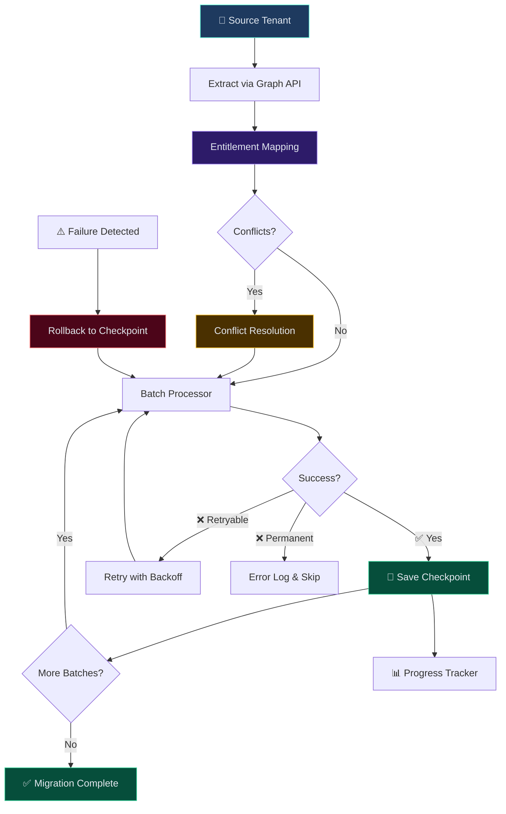

# Migration Patterns — Cross-Tenant Data Transfer

> Demonstrates the **migration architecture patterns** I built for cross-tenant Microsoft Teams & SharePoint migrations — incremental sync, entitlement mapping, checkpoint-based rollback, and real-time monitoring.

## What This Showcases

Architecture patterns from the **Cross-Tenant Migration System** I built handling 10,000+ users and 2TB+ SharePoint data — in simplified, runnable Python.

### Patterns Demonstrated

| Pattern | Implementation |
|---|---|
| **Incremental Migration** | Delta-sync — only transfer changed items since last checkpoint |
| **Checkpoint & Rollback** | Save progress at each batch, rollback to last checkpoint on failure |
| **Entitlement Mapping** | Map permissions across tenants with conflict resolution |
| **Batch Processing** | Process large datasets in configurable batches with retry |
| **Progress Tracking** | Real-time migration status with per-entity progress |
| **Error Classification** | Categorize failures (retryable vs permanent) for handling |

## Architecture



## Running

```bash
python -m src.migration_demo
```

No external dependencies — pure Python.

## Project Structure

```
src/
├── checkpoint.py      # Checkpoint save/restore for rollback
├── entitlement.py     # Permission mapping across tenants
├── batch_processor.py # Batch processing with retry logic
├── error_handler.py   # Error classification (retryable vs permanent)
├── progress.py        # Real-time progress tracking
└── migration_demo.py  # End-to-end demo runner
```
