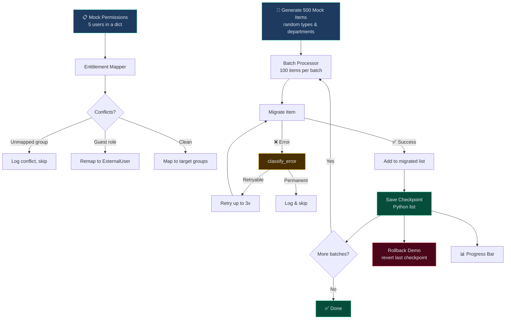

# Migration Patterns — Cross-Tenant Data Transfer

> A runnable demo of the **migration architecture patterns** I used for cross-tenant Microsoft Teams & SharePoint migrations — entitlement mapping, batch processing with retry, in-memory checkpointing, and rollback simulation. Pure Python, no external dependencies.

## What This Demo Does

Simulates migrating 500 items (Teams channels, SharePoint sites, mailboxes, OneDrive) across tenants using mock data — all in-memory, single-run, no persistence. Demonstrates the **patterns**, not the infrastructure.

### Patterns Demonstrated

| Pattern | What the demo does |
|---|---|
| **Entitlement Mapping** | Maps 5 mock users' permissions from source → target tenant, detects conflicts (unmapped groups, guest access) |
| **Batch Processing** | Splits 500 items into batches of 100, processes each with 90% simulated success rate |
| **Retry with Classification** | Failed items are classified (retryable vs permanent) — retryable items retry up to 3 times |
| **Checkpoint (In-Memory)** | After each successful batch, saves a checkpoint to a Python list — used for rollback |
| **Rollback** | Reverts to previous checkpoint, reports which items need reprocessing |
| **Progress Tracking** | Renders a progress bar with success/fail counts and throughput rate |

## Architecture (What the Demo Actually Runs)



## Running

```bash
python -m src.migration_demo
```

No external dependencies — pure Python. Runs in <1 second.

## Example Output

```
📋 Step 1: Entitlement Mapping
  Mapped 5 users
  Conflicts: 2
    - unmapped_group: 1
    - guest_access: 1

📦 Step 2: Batch Processing (500 items, batch_size=100)
  [████████████████████████████████████░░░░] 91.0%  (455/500)
  Succeeded: 455 | Failed: 45
  Retries: 12
  Checkpoints: 5

🔄 Step 3: Checkpoint Rollback Demo
  Rolled back to: cp-0003
  Batches reverted: 1
  Items to reprocess: 92
```

## Project Structure

```
src/
├── entitlement.py     # Maps permissions across tenants with conflict detection
├── batch_processor.py # Processes items in batches with retry logic
├── error_handler.py   # Classifies errors as retryable vs permanent
├── checkpoint.py      # In-memory checkpoint save/rollback (Python list)
├── progress.py        # Progress bar + throughput stats
└── migration_demo.py  # Orchestrates all 3 steps
```
